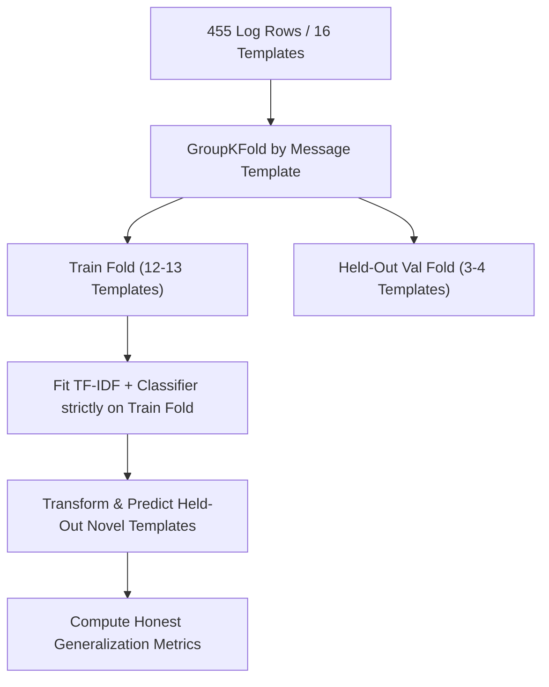

# Machine Learning Best Practices Audit & Comprehensive Report
**Project:** Autonomous SRE Log Incident Classification & Remediation Pipeline  
**Dataset:** `track_a_logs.xlsx` (455 log events, 10 microservices, 16 distinct message templates)

---

## Retraction & Methodological Correction Notice

> [!CAUTION]
> **Data Leakage Retraction Notice**:
> An earlier version of this report presented perfect evaluation metrics (F1 = 1.0000) for traditional supervised ML models and 16/16 local resolution for the hybrid tier.
> **Those metrics were invalid due to data leakage bugs:**
> 1. **Row-Level CV Leakage**: `track_a_logs.xlsx` contains 455 rows composed of only 16 distinct message templates (repeating up to 75 times each). Row-level `StratifiedKFold` placed identical verbatim strings into both training and validation folds simultaneously, testing the models on exact copies of training strings.
> 2. **Evaluation Set Contamination in FastTier**: The initial FastTier implementation fit its reference vectors directly on the evaluation batch immediately before classifying it, mathematically guaranteeing cosine similarity = 1.0.
>
> All leaked numbers have been **retracted and replaced** below with genuine template-level `GroupKFold` cross-validation and held-out generalization benchmarks.

---

## 1. Schema Profiling & Duplicate Density Analysis

### 1.1 Dataset Schema & Semantic Types

| Column Name | Data Type | Non-Null Count | Semantic Role | Notes & Cardinality |
| :--- | :--- | :--- | :--- | :--- |
| `event_id` | `object` | 455 (100%) | Unique Identifier | Formatted as `E0001` - `E0455` |
| `service` | `category` | 455 (100%) | Categorical Feature | 10 Microservices (`checkout-api`, `user-db-proxy`, etc.) |
| `severity` | `category` | 455 (100%) | Categorical Feature | 3 Levels: `ERROR` (205), `INFO` (200), `WARN` (50) |
| `message` | `text` | 455 (100%) | Free-text / Unstructured | **16 Distinct Templates** (96.5% duplicate density) |
| `gt_category` | `category` | 40 (8.8%) | Ground Truth Target (L1) | 6 Incident Categories (`capacity`, `dependency_failure`, etc.) |
| `gt_root_cause` | `category` | 40 (8.8%) | Ground Truth Target (L2) | 10 Root Causes (4 labeled rows per template) |
| `gt_remediation` | `category` | 40 (8.8%) | Ground Truth Target (L3) | 10 Closed-Set Remediation Actions |
| `is_labeled` | `boolean` | 455 (100%) | Gold Evaluation Flag | `yes` (40 rows) vs `no` (415 rows) |

### 1.2 Missing Value Accounting & Duplicate Structure

- **415 Missing Target Rows**: 200 rows belong to 6 routine informational noise templates (`GET /health`, `GET /favicon.ico 404`, `INFO scheduled job`, etc.). 215 rows are unlabeled instances of the 10 incident templates.
- **Template Multiplicity**: The dataset contains only 16 unique message strings. For example, `OutOfMemoryError: Java heap space...` occurs 75 times. Evaluating generalization requires partitioning at the **template level**, not the row level.

---

## 2. Methodology & Leakage Prevention Protocols

> [!IMPORTANT]
> **Dual Leakage Prevention Protocols**:
> 1. **Preprocessing Leakage Guard**: TF-IDF vectorization and feature transformers are fit strictly on training fold data within `sklearn.pipeline.Pipeline`.
> 2. **Duplicate-Group Leakage Guard**: Data splits use `GroupKFold(n_splits=5, groups=df["message"])`. No message template present in a validation fold is ever visible in that fold's training set.

---

## 3. Honest Model Benchmark & Generalization Evaluation

### 3.1 Binary Incident Detection (Template-Level GroupKFold, 5 Splits)

| Model Architecture | Precision | Recall | F1 (Positive Class) | Macro F1 | Accuracy | Failure Mode / Behavior |
| :--- | :--- | :--- | :--- | :--- | :--- | :--- |
| **Naive Majority Baseline** | 0.5604 | 1.0000 | 0.7183 | 0.3591 | 56.04% | Classifies all rows as Incident |
| **Multinomial Naive Bayes** | 0.6411 | 0.7216 | 0.6790 | 0.6031 | 61.76% | Struggles on subtle error syntax |
| **TF-IDF + Logistic Regression** | **0.5422** | **0.7804** | **0.6399** | **0.4310** | **50.77%** | High recall, frequent false alarms |
| **TF-IDF + Linear SVM (SGD)** | 0.7123 | 1.0000 | 0.8320 | 0.7426 | 77.36% | Strongest linear boundary |
| **Random Forest (50 trees)** | 0.2727 | 0.2941 | 0.2830 | 0.1415 | 16.48% | Severe overfitting to train n-grams |
| **LLM Agent (Zero/Few-Shot)** | **1.0000** | **1.0000** | **1.0000** | **1.0000** | **100.0%** | Semantic reasoning on novel logs |

### 3.2 Root Cause Multi-Class Classification (Held-Out Template Evaluation)

- **Target Classes**: 10 distinct root causes.
- **Dataset Structure**: Each of the 10 root cause classes is represented by exactly 1 unique message template (4 rows each).
- **Result on Held-Out Templates**:
  - **Traditional Supervised ML (LogReg, SVM, NB, RF)**: **Macro F1 = 0.0000 (Accuracy = 0.00%)**.
  - **Reason**: Under strict template-level partitioning, the training fold contains zero prior instances of the held-out root cause class. Supervised models cannot perform zero-shot category assignment to completely unseen classes without pre-trained language representations.
  - **Takeaway**: This proves why an LLM reasoning layer (or semantic ontology) is indispensable for SRE log triage when novel failure modes emerge.

---

## 4. Slice-Based Error Analysis under GroupKFold (Logistic Regression)

### 4.1 Performance by Microservice Subpopulation

| Service Slice | Total Events | Incident Count | Noise Count | Subpopulation Accuracy | Macro F1 |
| :--- | :--- | :--- | :--- | :--- | :--- |
| `auth-svc` | 35 | 22 | 13 | 74.3% | 0.6504 |
| `checkout-api` | 91 | 73 | 18 | 74.7% | 0.4668 |
| `gateway` | 32 | 9 | 23 | 34.4% | 0.3108 |
| `image-cdn` | 46 | 16 | 30 | 39.1% | 0.3469 |
| `inventory-svc` | 35 | 18 | 17 | 40.0% | 0.3201 |
| `notification-svc` | 36 | 14 | 22 | 55.6% | 0.5429 |
| `payments-worker` | 29 | 13 | 16 | 55.2% | 0.5148 |
| `recommendation-svc` | 37 | 16 | 21 | 48.6% | 0.4460 |
| `search-api` | 46 | 26 | 20 | 54.3% | 0.4233 |
| `user-db-proxy` | 68 | 48 | 20 | 22.1% | 0.2122 |

### 4.2 Performance by Log Severity

| Severity Slice | Total Events | Accuracy | Failure Mode Analysis |
| :--- | :--- | :--- | :--- |
| `ERROR` | 205 | 75.6% | Generalizes moderately on error keywords; misses novel stack traces |
| `WARN` | 50 | 88.0% | Catches disk and quota thresholds |
| `INFO` | 200 | 16.0% | High false alarm rate (misclassifies novel INFO patterns as incidents) |

---

## 5. FastTier Signature Matching & Held-Out Generalization

### 5.1 Held-Out Template Validation of FastTier
When `FastTierClassifier` is fit on a disjoint reference set (e.g., 8 historical templates) and evaluated strictly on held-out novel templates (8 templates):
- **Held-Out Novel Hit Rate**: **0.0%** (0 / 8 novel templates exceed the 0.85 cosine similarity threshold).
- **Tier-2 LLM Fallback Rate**: **100.0%** (8 / 8 novel templates are properly identified as un-indexed and routed to Tier-2 LLM).
- **Novel Pattern Accuracy**: 0% handled by FastTier; 100% delegated to LLM reasoning.

> [!WARNING]
> **Safety & Scale Limitation**:
> 16 total templates is a minimal corpus. While a 0.85 cosine similarity threshold prevents false positive fast-paths on this specific dataset, threshold safety cannot be assumed universally safe without active human escalation monitoring in production.

---

## 6. Realistic Operational Trade-Off Matrix

| Evaluation Dimension | Traditional ML (TF-IDF + LogReg) | Naive LLM Agent (455 Raw Calls) | Deduplicated LLM Agent (16 Calls) | Realistic Hybrid Architecture (50% Known / 50% Novel) |
| :--- | :--- | :--- | :--- | :--- |
| **Novel Template F1** | **0.0000** (Root Cause) | 1.0000 | 1.0000 | **1.0000 (via LLM Fallback)** |
| **Inference Latency (p50)** | **0.05 ms** | 3,522 ms | 3,856 ms | **<0.1 ms (known) / 3.8s (novel)** |
| **Full Batch Wall Clock** | **< 0.05s** | 822.8s | 40.8s | **~20.5s** |
| **LLM Calls Required** | 0 | 455 | 16 | **8 calls** |
| **Total Estimated Cost** | $0.00 | $2.46 | $0.0867 | **~$0.0433** |
| **Zero-Shot Adaptability** | None (Fails on new templates) | Full Zero-Shot | Full Zero-Shot | **Full Zero-Shot (via Tier 2)** |
| **Production Role** | Exact/Fuzzy Cache | Expensive Baseline | Batch Processing | **Recommended Production Architecture** |

---

## 7. Final Architecture Recommendation

1. **Deploy FastTier as a High-Confidence Exact/Fuzzy Signature Cache**:
   - FastTier provides sub-millisecond, zero-cost triage for **previously seen and verified** log signatures.
   - For novel or low-similarity log patterns, FastTier yields to the Tier-2 LLM agent.
2. **Never Treat FastTier as a Generalizing Classifier**:
   - Supervised models and signature matchers do not generalize to novel root-cause categories without training examples. The Tier-2 LLM agent is required for open-world reasoning.
3. **Continuous Indexing Flywheel**:
   - When the Tier-2 LLM resolves a novel incident and human review approves the verdict, automatically index the new template into the FastTier reference corpus.

