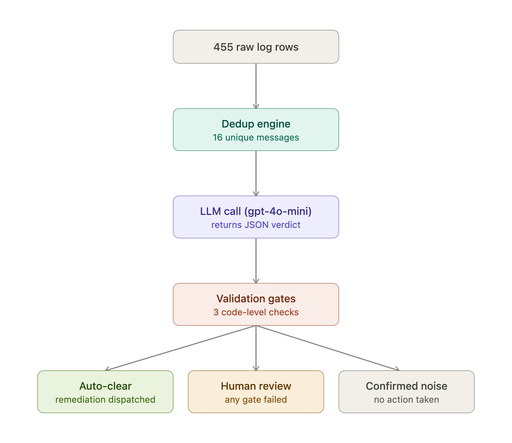
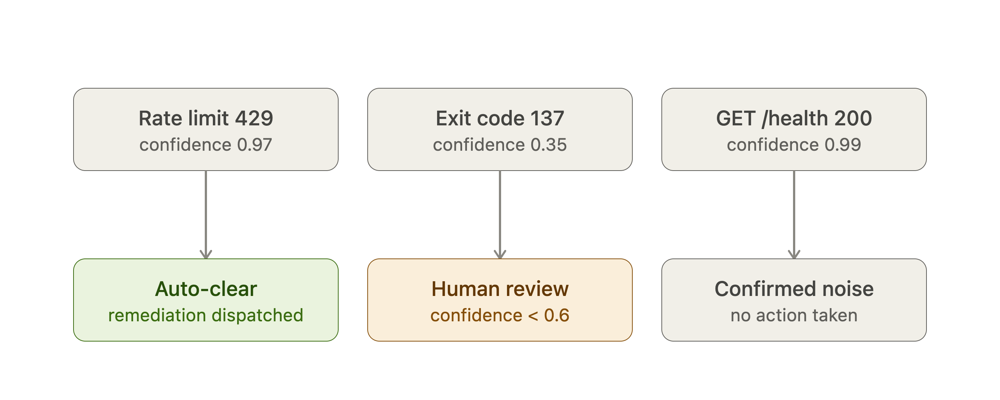

# Guarded LLM Agents: Log Triage and Sales Outreach

This repo has two separate projects. Both use an agent on Lyzr Agent Studio, and both have a test script (`harness.py`) that calls the agent through its API and measures the results.

- [`track_a/`](track_a/) — **Auto-Remediation from Logs**: reads server logs, finds real incidents, and picks a fix from a fixed list.
- [`track_b/`](track_b/) — **Account-Based Management**: sorts sales accounts into tiers, decides which ones to target, and writes a short first message for each one.

Shared parts:

- [`common/lyzr_client.py`](common/lyzr_client.py) — code both tracks use: the API call with retries, reading JSON from the model's answer, and token/cost estimates.
- [`tests/`](tests/) — tests for both tracks. They make no API calls, so they are free and fast.

## Setup (for both tracks)

```bash
python3 -m venv venv && source venv/bin/activate
pip install -r requirements.txt
```

Create a `.env` file in the repo root:

```
LYZR_API_KEY=...
LYZR_USER_ID=...
LYZR_AGENT_ID=...        # Track A agent
LYZR_AGENT_ID_B=...      # Track B agent
```

Run the tests:

```bash
pytest
```

Each harness saves its output (raw CSVs and a summary JSON) in its own `results/` folder, for example `track_b/results/`. Use `--out-dir` and `--out-prefix` to change this.

---

## Track A: Auto-Remediation from Logs

### Results (all 455 log events, both runs use the same live agent)

| Metric                           | Target | Naive (455 calls) | Optimized (16 calls) |
| -------------------------------- | ------ | ----------------- | -------------------- |
| Category macro-F1 (40 labeled)   | ≥ 0.85 | 1.00              | 1.00                 |
| Root-cause macro-F1 (40 labeled) | ≥ 0.80 | 1.00              | 1.00                 |
| Free-form remediations           | 0      | 0                 | 0                    |
| False escalation rate            | report | 0.0%              | 0.0%                 |
| p50 latency, escalated events    | report | 3.68s             | 4.08s                |
| p95 latency, escalated events    | ≤ 4.0s | 5.27s             | 3.9–4.6s (see note)  |
| Total tokens                     | report | 1,579,688         | 55,592               |
| Total cost (est.)                | report | $2.48             | $0.087               |
| Cost per task                    | report | $0.00544          | $0.00019             |
| Cost reduction vs. naive         | ≥ 50%  | —                 | 96.5% (28.3×)        |
| Wall clock, full batch           | report | 424s              | 15–32s               |
| Throughput                       | report | 64 tasks/min      | 866–1844 tasks/min   |

**Why cost drops so much:** the 455 log lines contain only 16 different messages. The optimized run sends each unique message to the agent once, then copies the answer to every matching line. So it makes 16 calls instead of 455.

**About p95 latency:** the optimized run makes only 16 calls, so its p95 is based on very few samples and changes from run to run. Three runs gave 3.91s, 4.34s and 4.65s. Read it as "around 4 seconds", not as an exact number.

**About cost:** Lyzr's API does not return token counts. All token and cost numbers are estimates. The estimate was checked against 16 real calls from the Studio traces page (details at the top of `harness.py`). The difference between naive and optimized is reliable, because it comes from making 16 calls instead of 455.

### Files

- [`harness.py`](track_a/harness.py) — the test script: naive run, optimized run, hybrid run, metrics, and a cost-check helper.
- [`payload.json`](track_a/payload.json) — the agent's settings (instructions, examples, model), same as what is live on Studio.
- [`track_a_logs.xlsx`](track_a/track_a_logs.xlsx) — the provided dataset.
- [`ml_best_practices_pipeline.py`](track_a/ml_best_practices_pipeline.py) and [`ML_BEST_PRACTICES_REPORT.md`](track_a/ML_BEST_PRACTICES_REPORT.md) — an extra check of the ML approach using template-level cross-validation.

### How it works

Raw logs → remove duplicates → agent gives a verdict → code checks the verdict → final result.



Examples of how single events are routed:



### How to run

| Mode        | Command                                      | What it does                                                                                                  | Agent calls       |
| :---------- | :------------------------------------------- | :------------------------------------------------------------------------------------------------------------ | :---------------- |
| `both`      | `python track_a/harness.py --mode both`      | Runs naive and optimized, and prints a comparison table.                                                      | 455 + 16          |
| `optimized` | `python track_a/harness.py --mode optimized` | Removes duplicates first, then copies each answer back to all matching lines.                                 | 16                |
| `naive`     | `python track_a/harness.py --mode naive`     | One call for every log line. No duplicate removal.                                                            | 455               |
| `hybrid`    | `python track_a/harness.py --mode hybrid`    | First tries a fast local match against known messages (free, under 0.1ms). Only new messages go to the agent. | New messages only |
| `all`       | `python track_a/harness.py --mode all`       | Runs naive, optimized and hybrid, and compares all three.                                                     | 455 + 16 + new    |
| `calibrate` | `python track_a/harness.py --mode calibrate` | Compares the cost estimate with a real trace you paste in.                                                    | 0                 |

Extra options for the hybrid mode:

```bash
# Test only on messages the fast matcher has never seen (all should go to the agent)
python track_a/harness.py --mode hybrid --holdout-eval

# Use a separate file of past logs for the fast matcher
python track_a/harness.py --ref-data historical_reference.xlsx --mode hybrid

# Change how close a match must be to count (default 0.85)
python track_a/harness.py --mode hybrid --similarity-threshold 0.90

# Run the template-level cross-validation check
python track_a/ml_best_practices_pipeline.py
```

### Studio settings and why

| Feature                                | On?             | Why                                                                                                                                                                                                                                                                                                                                                 |
| -------------------------------------- | --------------- | --------------------------------------------------------------------------------------------------------------------------------------------------------------------------------------------------------------------------------------------------------------------------------------------------------------------------------------------------- |
| Conversation memory (`store_messages`) | Off             | Each log line is handled on its own. Memory would only add tokens and time.                                                                                                                                                                                                                                                                         |
| 4 few-shot examples                    | On              | They show the model the exact labels to use, so it copies them correctly.                                                                                                                                                                                                                                                                           |
| JSON schema / `response_format`        | Off, on purpose | This caused a real outage: Lyzr quietly switched to a backup model that could not handle the schema, and every call failed with a 400 error. Now the prompt asks for JSON, and `harness.py` checks every answer against the allowed lists. If the model gets something wrong, the event goes to human review instead of the whole pipeline failing. |
| Backup model (multi-provider fallback) | On              | Protects against a provider outage. Not yet saved into `payload.json`.                                                                                                                                                                                                                                                                              |

### Known limits

- Token and cost numbers are estimates, not numbers from the API.
- The false escalation rate assumes every message outside the 40 labeled ones is noise. This is true for this dataset, but not guaranteed in general.
- `category` is worked out in code from `root_cause`, so its score always matches the root-cause score. It is not a separate model result.
- The optimized p95 latency is based on only 16 calls.

---

## Track B: Account-Based Management

### Results (all 200 accounts, both runs use the same live agent)

| Metric                            | Naive (200 calls) | Optimized (95 calls) |
| --------------------------------- | ----------------- | -------------------- |
| Tier accuracy (25 labeled)        | 1.00              | 1.00                 |
| Target/skip accuracy (25 labeled) | 1.00              | 1.00                 |
| Openers with a made-up fact       | 0 of 95           | 0 of 95              |
| Tier corrected by code            | 10 of 95          | 4 of 95              |
| Next action corrected by code     | 33 of 95          | 30 of 95             |
| Invalid agent answers             | 0                 | 0                    |
| Sent to human review              | 0                 | 0                    |
| p50 / p95 latency                 | 2.01s / 3.69s     | 2.24s / 3.58s        |
| Total tokens (est.)               | 699,761           | 335,011              |
| Total cost (est.)                 | $1.11             | $0.54 (−51%)         |
| Cost per account (est.)           | $0.0056           | $0.0027              |
| Batch time                        | 113s              | 57s                  |
| Throughput                        | 106 accounts/min  | 211 accounts/min     |

Agent settings for this run: `gpt-4o-mini`, temperature 0, memory off, `max_iterations` 1 (see [`payload.json`](track_b/payload.json)).

**Why the code corrects the agent:** tier and next action both follow fixed rules, so the code works them out itself and uses its own answer when the agent disagrees.

- **Next action:** the agent ignored the priority rule for about one account in three. Most misses were accounts with a funding signal, which should get `schedule_intro_call` but got `send_case_study` or `request_warm_intro`. The old Studio settings (temperature 0.7, memory on) gave the same miss rate, so the settings are not the cause.
- **Tier:** every correction was a company with exactly 140 employees that the agent put in tier B, even though 140 ≥ 100. None of these were labeled accounts, so the 1.00 tier accuracy is the agent's own result.

**Why cost halves:** 105 of the 200 accounts have no signals at all, so there is nothing true to write about them. The optimized run spots these in code and marks them `insufficient_data` without calling the agent. In the naive run, the agent gave the same answer for all 105 of them, so skipping them saves money without changing any results.

**Why accuracy is 1.00 in both runs:** in the labeled data, tier depends only on company size (100+ employees is tier A, fewer is tier B), and all 25 labeled accounts should be targeted. So these scores show the pipeline is correct. They do not show the model making hard decisions.

**About cost:** same as Track A. These are estimates, because Lyzr's API does not return token counts.

### Files

- [`harness.py`](track_b/harness.py) — the test script: naive run, optimized run, answer checks, metrics.
- [`AGENT_SETUP.md`](track_b/AGENT_SETUP.md) — how the agent is set up on Studio: name, role, goal, instructions, examples, model, and features.
- [`payload.json`](track_b/payload.json) — the agent's settings, exported from Studio.
- [`track_b_accounts.xlsx`](track_b/track_b_accounts.xlsx) — the 200 accounts.
- [`track_b_labels_and_kb.xlsx`](track_b/track_b_labels_and_kb.xlsx) — 25 labeled accounts, each with one confirmed fact (`verified_fact`).

### How it works

1. **Skip empty accounts (code, free):** accounts with no signals are marked `insufficient_data` with next action `add_to_nurture_sequence`. They are never sent to the agent.
2. **Add the confirmed fact:** for the 25 accounts that have a `verified_fact`, it is added to the agent's input. The answer columns (`gt_tier`, `gt_should_target`) are never sent.
3. **Agent answers:** it returns JSON with tier, target decision, next action, a one-sentence opener, confidence, and a short reason.
4. **Code checks the answer:**
   - All six fields must be there. If the wrong agent answers, the check fails loudly instead of returning empty results.
   - Tier is worked out again from employee count. If the agent disagrees, the code's value is used.
   - Next action must be one of: `schedule_intro_call`, `send_case_study`, `request_warm_intro`, `add_to_nurture_sequence`. It is also worked out again from the signals (funding → call, hiring → warm intro, launch or tech → case study). If the agent disagrees, the code's value is used.
   - Every number, amount and name in the opener (for example a technology, region or funding round) must appear in that account's own signals. If not, the opener is counted as made up and sent to human review.

### How to run

| Mode        | Command                                      | Agent calls |
| :---------- | :------------------------------------------- | :---------- |
| `both`      | `python track_b/harness.py --mode both`      | 200 + 95    |
| `optimized` | `python track_b/harness.py --mode optimized` | 95          |
| `naive`     | `python track_b/harness.py --mode naive`     | 200         |

Use `--max-tasks N` to change how many calls run at the same time (default 4). The script stops right away if `LYZR_AGENT_ID_B` is the same as the Track A agent ID.

### Studio settings and why

| Feature                                | On?             | Why                                                                                                                                                                                                      |
| -------------------------------------- | --------------- | -------------------------------------------------------------------------------------------------------------------------------------------------------------------------------------------------------- |
| Conversation memory                    | Off             | Each account is handled on its own.                                                                                                                                                                      |
| Knowledge Base                         | Off             | The "knowledge" is one short fact per account, looked up by account ID. The script can just add it to the prompt. A search-based knowledge base would be slower and could return another account's fact. |
| JSON schema / `response_format`        | Off, on purpose | Same reason as Track A. The code checks the answers instead.                                                                                                                                             |
| Reflection / extra reasoning steps     | Off             | The task is simple and follows clear rules. An extra step would cost more and be slower.                                                                                                                 |
| Backup model (multi-provider fallback) | On              | Same outage protection as Track A.                                                                                                                                                                       |

### Known limits

- Token and cost numbers are estimates. They reuse Track A's calibration (same platform, same model). Track B's prompt is shorter, so the real cost is probably a bit lower.
- Even at temperature 0, the wording of openers changes between runs (only 8 of 95 were the same in both runs). Tier and target decision were the same for all 95.
- The made-up-fact check only looks at numbers and capitalized words. It misses made-up details in lowercase. For example, one opener offered "a case study from a similar cybersecurity team", and that case study does not exist. Treat 0% as "no made-up facts found", not as proof.
- The labels have no examples of tier C, "skip", or next actions. So the next-action rule (funding → call, hiring → warm intro, tech or launch → case study) is a design choice. It was not tested against labels.
- The 25 labeled accounts are also used to check that the tier rule works, so the tier score is not a test on unseen data.
